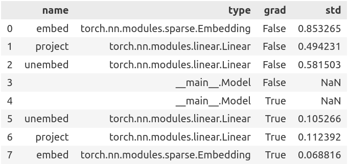

# Tensor tracker

Flexibly track outputs and grad-outputs of `torch.nn.Module`. [API documentation](https://graphcore-research.github.io/pytorch-tensor-tracker/).

```bash
pip install git+https://github.com/graphcore-research/pytorch-tensor-tracker
```

```python
import tensor_tracker

with tensor_tracker.track(module) as tracker:
    module(inputs).backward()

print(list(tracker))
# => [Stash(name="0.linear", type=nn.Linear, grad=False, value=tensor(...)),
#     ...]

display(tracker.to_frame())
```



See our [example of visualising transformer activations & gradients using UMAP](doc/Example.ipynb).

## License

Copyright (c) 2023 Graphcore Ltd. Licensed under the MIT License ([LICENSE](LICENSE)).

Our dependencies are (see [requirements.txt](requirements.txt)):

| Component | About | License |
| --- | --- | --- |
| torch | Machine learning framework | BSD 3-Clause |

We also use additional Python dependencies for development/testing (see [requirements-dev.txt](requirements-dev.txt)).
